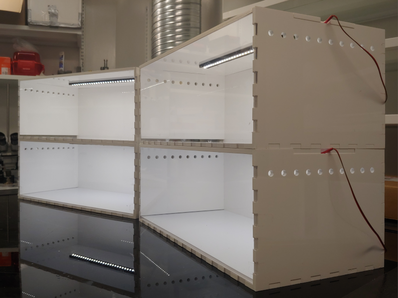
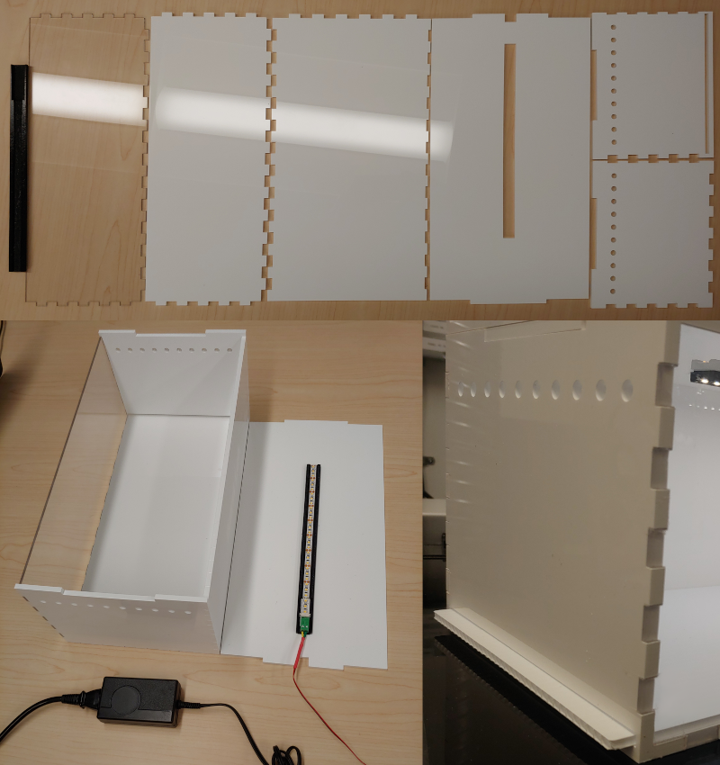

# Observation box for mice

Stackable boxes for observing animal behavior with individual lighting and removable floor and lid.

Inner dimensions are 40 x 15 x 20 cm (approx. 15 3/4 x 7 3/4 x 6")

## Components
- [6mm opaque white acrylic sheets](https://www.polymershapes.com/product/acrylic/)
- [3mm clear acrylic sheets](https://www.polymershapes.com/product/acrylic/)
- [4mm corrugated plastic sheets](https://www.polymershapes.com/product/polypropylene-twinwall-corrugated-plastic/)
- [Strip of 30+ LEDs](https://www.digikey.ca/en/products/detail/inspired-led-llc/12V-MB-PW-12M/5866486)
- [LED connector](https://www.digikey.ca/en/products/detail/inspired-led-llc/3496/5866456)
- [Power supply](https://www.digikey.ca/en/products/detail/sl-power-electronics-manufacture-of-condor-ault-brands/ME30A1203F01/5400157)
- [Female DC barrel jack adapter](https://www.digikey.ca/en/products/detail/sparkfun-electronics/PRT-10288/6163697)
- [Power cord](https://www.digikey.ca/en/products/detail/cui-devices/AC-C13-JP/3479178)
- Two-wire cable

## Build instructions
- 3D print the LED holder using the [provided CAD model](CAD). Remove print supports.
- Laser cut the acrylic sheets using the [provided CAD drawings](CAD). Remove protective film.
- Finish cutting the corrugated plastic with the help of a utility knife, if needed.
- Peel the adhesive backing from the LED connector and attach it to the wide space of the LED holder, with the screw terminals facing out.
- Peel the adhesive backing from the LED strip; connect the LED strip to the LED connector -making sure to match the polarity and attach it to the narrow space of the LED holder.
- Connect positive and negative sides of the LED connector to the positive and negative sides of the DC adapter (respectively). Optionally, add a 50 to 200 Ohm resistor in series with one of the two LED cables to dim the lights.
- Assemble all acrylic parts (except for the roof) using painter's tape and apply acrylic cement or 2-part epoxy. Remove painter's tape after drying.
- Use Cyanoacrylate to attach the LED setup to the removable lid.

## Usage
- Insert the removable floor made of corrugated plastic.
- Place the mouse in the cage.
- Close the lid and power on the LEDs.

## Version History
### 0.1.0
* 2022-05-13
  - Initial Release.

## License
© 2022 [Leonardo Molina][Leonardo Molina]

This project is licensed under the [Creative Commons BY-NC-SA 4.0 License](https://creativecommons.org/licenses/by-nc-sa/4.0/).

[Leonardo Molina]: https://github.com/leomol
[LICENSE.md]: LICENSE.md